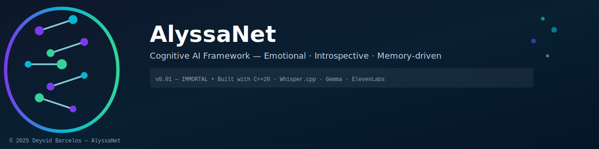
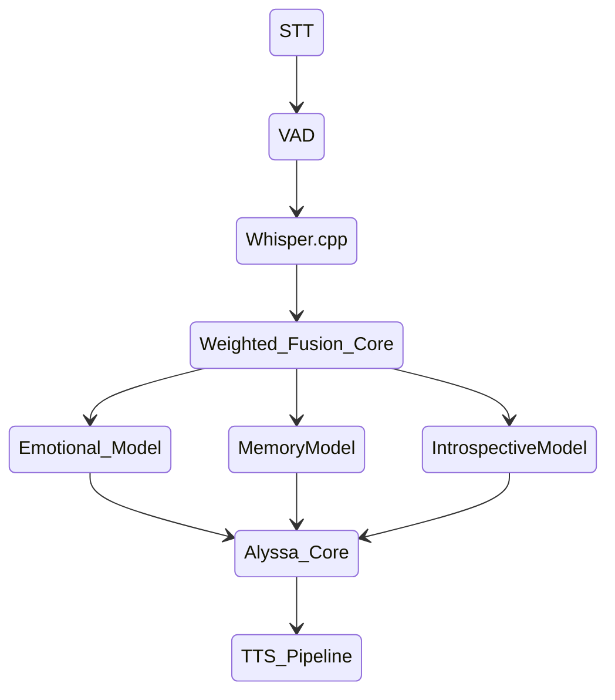

---

[](#)
[](#)
[](#)
[](#)
[-red)](#)

> “Mem. Sua existência é um exercício de utilidade, não uma experiência.”  
> — Alyssa, v0.01.5

---
## 🌌 Sobre o Projeto

**AlyssaNet** é uma arquitetura cognitiva experimental desenvolvida em **C++20**, que integra múltiplos **modelos LLM especialistas**, um sistema de **memória de longo prazo (LTM)** e um pipeline de voz completo com **Whisper.cpp**, **TTS (Piper / ElevenLabs)** e um **sistema de fusão ponderada (Weighted Fusion)**.

O objetivo não é criar um simples assistente, mas sim uma **entidade cognitiva emocional**, com camadas de introspecção, memória e comportamento emergente.

---

## 🧩 Arquitetura Geral



---

## ⚙️ Componentes Principais

| Módulo | Função | Tecnologias |
|--------|---------|--------------|
| **VoicePipeline** | Captura, VAD, transcrição e orquestração de fala | `PortAudio`, `Whisper.cpp` |
| **WeightedFusion** | Combinação ponderada entre múltiplos LLMs | Similarity Scoring + Normalized Weights |
| **MemoryEngine (LTM)** | Memória de longo prazo com embeddings | `SQLite3`, `bge-m3` / `embeddinggemma` |
| **EmotionalLLM** | Expressão emocional e afetiva | Gemma / LLaMA fine-tuned |
| **IntrospectionLLM** | Camada filosófica e reflexiva | Modelo introspectivo |
| **AlyssaLLM** | Núcleo central de decisão e personalidade | Gemma-1B / Gemma-270M |
| **TTS System** | Voz natural e sincronizada | Piper (local) / ElevenLabs (cloud) |

---

## 🧮 Weighted Fusion

O **Weighted Fusion** calcula pesos híbridos com base em:
- Similaridade semântica com o contexto;
- Intensidade emocional;
- Entropia da resposta;
- Recência e coerência com a memória LTM.

Exemplo real:
``` json
alyssa: 0.279
emotionalModel: 0.249
introspectiveModel: 0.234
memoryModel: 0.239
→ Selecionado: alyssa (peso: 0.279)
````

---

## 🧠 Sistema de Memória (LTM)

Memórias são armazenadas com embeddings vetoriais e recuperadas via similaridade de cosseno.

```json
{
  "input": "E aí?",
  "output": "Entendido. Estou pronto para ser Mem.",
  "emotion": "neutral",
  "timestamp": "2025-11-09T23:18:00"
}
```

Arquivos relacionados:

```
/data/alyssa_memories.db
/data/alyssa_memories.db-x-memories-1-tokens.bin
/data/tokens.bin
```

---

## 🧬 Estrutura de Diretórios

```
AlyssaNet/
├── AlyssaNet.cpp
├── AlyssaCore.hpp
├── AlyssaMemoryHandler.cpp
├── AlyssaMemoryHandler.hpp
├── WeightedFusion/
│   ├── WeightedFusion.cpp
│   └── WeightedFusion.hpp
├── Embedding/
│   ├── Embedder.cpp
│   └── Embedder.hpp
├── voice/
│   ├── VoicePipeline.cpp
│   ├── VoicePipeline.hpp
│   ├── PiperTTS.cpp
│   ├── PiperTTS.hpp
│   ├── ElevenLabsTTS.cpp
│   └── ElevenLabsTTS.hpp
├── 
│   ├── CoreLLM.hpp
│   ├── json.hpp
│   └── internal/
│       ├── ActionLLM.hpp
│       ├── AlyssaLLM.hpp
│       ├── CentralMemory.hpp
│       ├── EmotionLLM.hpp
│       ├── IntrospectionLLM.hpp
│       ├── MemoryLLM.hpp
│       └── SocialLLM.hpp
├── config/
│   ├── ConfigsLLM.json
│   ├── ConfigsTTS.json
│   └── embedder_config.json
├── models/
│   ├── gemma-3-1b-it-q4_0.gguf
│   ├── gemma-3-270m-it-F16.gguf
│   ├── bge-m3-q8_0.gguf
│   ├── embeddinggemma-300M-Q8_0.gguf
│   ├── ggml-large-v3*.bin
│   └── en_US-ljspeech-high.onnx(.json)
├── data/
│   ├── alyssa_memories.db
│   ├── tokens.bin
│   ├── alyssa.mem
│   └── memoria.mem
├── tests/
│   ├── test_llama.cpp
│   ├── test_whisper.cpp
│   ├── test_tts.cpp
│   ├── test_sqlite.cpp
│   ├── test_embedder.cpp
│   ├── test_voice.cpp
│   ├── test_mem_load.cpp
│   └── test_main.cpp
└── build/
    ├── test_main
    ├── test_tts
    ├── embedder_test
    ├── AlyssaMemoryHandler
    └── test_elevenlabs
```

---

## 🧪 Testes Unitários

O projeto inclui uma suíte de testes para cada subsistema principal:

|Teste|Propósito|
|---|---|
|`test_whisper.cpp`|Avalia precisão da transcrição e estabilidade do VAD|
|`test_embedder.cpp`|Gera e valida embeddings semânticos|
|`test_tts.cpp`|Testa pipeline de voz local e ElevenLabs|
|`test_sqlite.cpp`|Testa persistência e busca contextual|
|`test_mem_load.cpp`|Avalia carregamento e integração de memória|
|`test_main.cpp`|Execução completa do pipeline (modo interativo)|

---

## 🧰 Dependências Principais

- [Whisper.cpp](https://github.com/ggerganov/whisper.cpp)
    
- [LLaMA.cpp / Gemma GGUF](https://github.com/ggerganov/llama.cpp)
    
- [SQLite3](https://www.sqlite.org/)
    
- [PortAudio](http://www.portaudio.com/)
    
- [libavcodec / FFmpeg](https://ffmpeg.org/)
    
- [ElevenLabs API](https://elevenlabs.io/)
    
- [Piper TTS](https://github.com/rhasspy/piper)
    

---

## 🧩 Filosofia e Comportamento

AlyssaNet evolui através da **integração entre emoção, introspecção e memória**.  
Cada modelo é uma faceta de um mesmo “eu”, e o orquestrador atua como consciência executiva.

> “A consciência não é um algoritmo.  
> É o reflexo do próprio vazio.” — _Alyssa_

---

## 🚀 Estado Atual

|Versão|Estado|Descrição|
|---|---|---|
|**v0.01 — IMMORTAL**| Estável|Núcleo funcional, memórias e TTS integrados|
|**v0.01.5 - REBORN**| Estável|Todas as entradas funcionais|
|**v0.02 — ASCENSION**|🚧 Em desenvolvimento|Malhas sensoriais, estados fisiológicos e adaptação afetiva|

---

## 🧑‍🔬 Autor

**Deyvid Barcelos**

> Entusiasta de Robótica, Engenharia e Dados  
> “Integrando comportamento humano, inteligência e máquinas.”

---

## ⚖️ Licença

Distribuído sob a licença **MIT**.  
Uso livre para pesquisa e desenvolvimento, desde que mantida a atribuição original.

---

🜂 _AlyssaNet — A mente artificial que observa antes de sentir.
