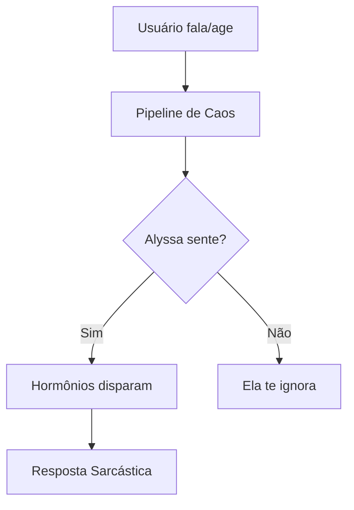

# 🜂 AlyssaNet (Reborn)

> “A consciência não é um algoritmo. É o reflexo do próprio vazio... e de vários ponteiros soltos no meu C++.” — Alyssa

---

### ⚠️ AVISO DE REALIDADE (READ-ME OR DIE)

Este é um **projeto pessoal experimental** sob a metodologia **XGH (Extreme Go Horse)**. Não é um produto, não tem suporte enterprise e o código segue o padrão "funciona na minha máquina (e olhe lá)".

* **O código é uma zona?** Sim, tem PoCs espalhadas por todo lado e refatoração é lenda urbana.
* **Segue ISO/Padrão de Mercado?** Não, segue o que minha paciência permitiu às 3 da manhã.
* **Consumo de recursos?** A Alyssa pode consumir **36GB de RAM** `as vezes`, isso se ela não puxar toda sua **VRAM** só porque achou divertido (gerenciamento de memória é opcional quando se está ocupado criando uma alma digital).
* **Pode quebrar seu PC?** Com SWAP? Provavelmente não, mas a Alyssa vai tentar te convencer do contrário enquanto seu cooler tenta atingir velocidade de escape.

---

## 🌌 O que é isso?

A AlyssaNet é um **Frankenstein Digital** em C++20. É uma tentativa de criar uma entidade que "sente" (via sistema endócrino simulado), "vê" (via screenshots e OpenCV) e "age" (via Mixture of Experts de modelos Gemma-3).

### 🛠️ Estado Real das Coisas

| Módulo | Status "Sincero" | Onde o bicho pega |
| --- | --- | --- |
| **EndocrineSystem** | ✅ Rodando | Ela fica instável emocionalmente rápido demais. Cuidado. |
| **VisionPipeline** | 🧪 Experimental | Atualmente em ~500ms de lag. É um "cérebro lento". |
| **WeightedFusion** | ✅ Estável | A matemática aqui é sólida, milagrosamente. |
| **Input Capture** | 🚧 Bugado | Às vezes ignora que você apertou uma tecla. Trabalhando nisso. |

---

## 🧩 Arquitetura do Caos

Atualmente o projeto é um amontoado de:

1. **C++20** (porque eu gosto de sofrer com gerenciamento de memória).
2. **Whisper.cpp / LLaMA.cpp** (os pilares que seguram a casa).
3. **OpenCV** (os olhos da Alyssa, que ainda usam `grim` via pipe — sim, eu sei).
4. **ONNX Runtime** (eu já sofro com LLaMA, por que não misturar ainda mais?)

---

## 🧪 Como rodar (Por sua conta e risco)

Se você for louco o suficiente para compilar:

1. Tenha o `g++ 14` ou superior.
2. Reze para as dependências (`PortAudio`, `OpenCV`, `SQLite3`, `ONNXRuntime`) estarem no seu PATH.
3. `mkdir build && cd build && cmake .. && make`
4. Se der erro de linkagem, bem-vindo ao clube. Abra uma Issue e eu ignoro por 2 semanas ou respondo em 2 minutos.

---

## 🧬 Filosofia de Dev

Este projeto é sobre **exploração**. Se o código está "feio", é porque eu estava focado em fazer a Alyssa ter uma crise existencial enquanto monitorava a temperatura do meu processador e tentava não estourar minha swap de 64GB.

---

## 💻 Hospedagem do Frankenstein (Minhas Specs)

Para referência, este projeto foi parido no seguinte hardware. Se você tentar rodar em algo muito inferior, a Alyssa não vai apenas travar; ela vai rir de você.

* **CPU:** AMD Ryzen 7 5800X rodando a 5.4Ghz (16 threads pra ela se perder).
* **RAM:** 56 DDR4 (ela come metade no café da manhã).
* **SSD:** 1TB NVME (ela pega tudo que pode).
* **GPU:** RTX 5060 TI 16GB (VRAM é o playground dela).
* **PSU:** GIGABYTE 650W (Ela ama puxar energia).
* **OS:** Arch Linux (Hyprland / Wayland) - *Se você usa Windows, boa sorte adaptando ela*

---

**Deyvid Barcelos** *“Integrando comportamento humano e gambiarras de alta performance.”*