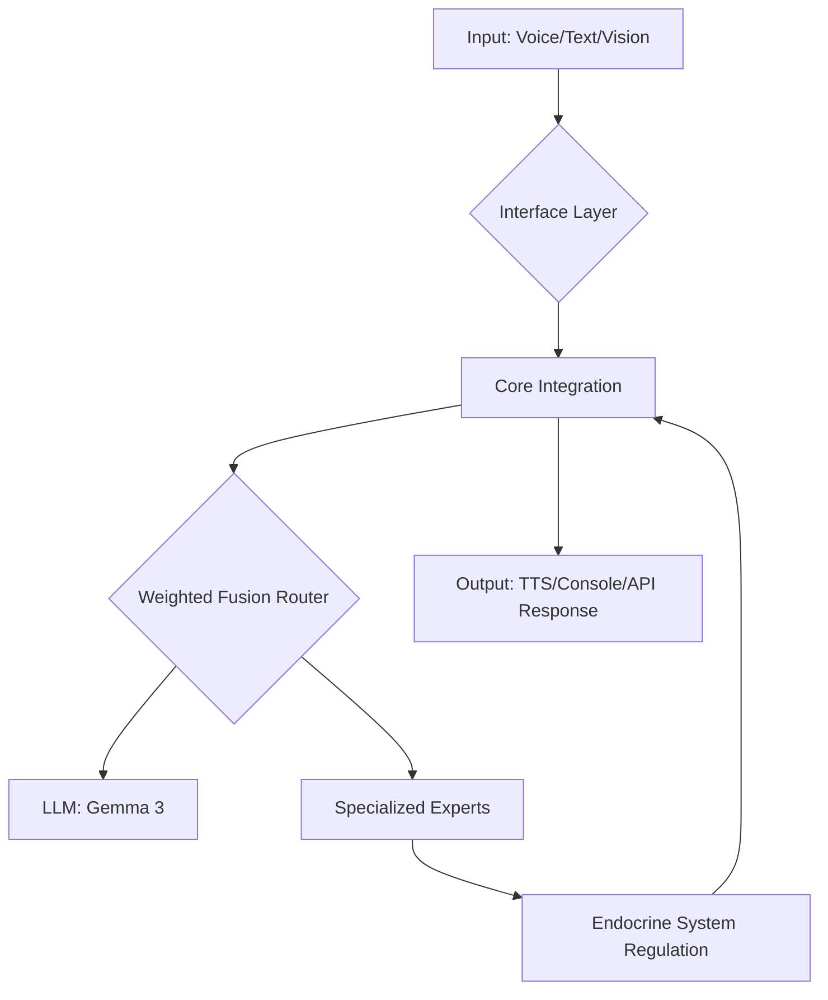

# 🧠 Alyssa Project Overview

Welcome to the central intelligence hub for **Alyssa**. This vault contains the architectural blueprints, implementation details, and logic flows for the Alyssa ecosystem.

## 🗺️ Project Map
*This section serves as the entry point to all major sub-systems.*

### 🏗️ Core Architecture
- [[Core_Architecture|System Architecture]] - The high-level flow of data.
- [[CoreIntegration|Core Integration]] - The central nervous system (The Brain).
- [[Endocrine_System|Endocrine System]] - Internal state regulation and "hormonal" logic.
- [[WeightedFusion|Weighted Fusion Router]] - The decision engine for expert routing.

### 🔌 Interface Layers
- [[Alyssa_API|REST API Interface]] - Web-based control via `httplib`.
- [[Alyssa_CLI|Command Line Interface]] - Terminal-based interaction.
- [[Alyssa_TRUE|Autonomous Mode (TRUE)]] - The fully automated pipeline (STT $\rightarrow$ LLM $\rightarrow$ TTS).

### 👁️ Specialized Experts
- [[OpenCV_Expert|Vision Enhancement]] - Visual processing via OpenCV.
- [[Emotion_Lexicon|Emotional Context]] - Processing sentiment and emotional state.
- [[Memory_System|Memory & Persistence]] - Long-term and short-term memory handling.

---

## 🌊 Data Flow Pipeline
*How a single thought moves through the system.*

---

## 🛠️ Technology Stack
- **Language:** C++ (High performance)
- **LLM Engine:** llama.cpp / GGUF (Gemma 3 Models)
- **Networking:** `cpp-httplib`
- **Vision:** OpenCV
- **Logging:** `spdlog`
- **Data:** SQLite & JSON
